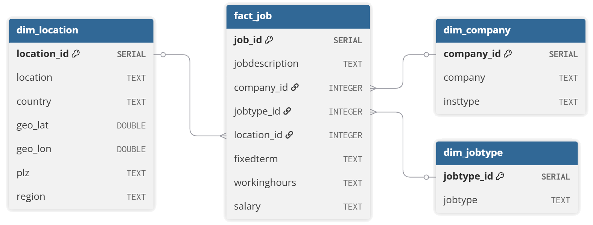

# Informationsintegration – Bibliojobs

[](https://www.python.org/)
[](https://pytest.org/)

Ein Projekt im Rahmen der Hausarbeit im 6. Fachsemester des Studiengangs **Informations- und Datenmanagement** an der **FH Potsdam**. Kursleitung: Prof. Dr. Günther Neher. Entwickelt von Holger Ehrmann.

> **Status:** Dieses Repository befindet sich in aktiver Entwicklung. Feedback und Beiträge sind willkommen.

## Aufgabenstellung

Im Rahmen einer Arbeitsmarktanalyse sollen Metadaten von ca. 23 000
Stellenanzeigen aus den Jahren 2014–2025 für das Berufsfeld
Bibliotheks- und Informationswissenschaft aufbereitet werden. Die
Rohdaten liegen als CSV-Datei `bibliojobs_raw.csv` mit elf Attributen
und dem Feldtrennzeichen `_§_` vor.

Ziel der Anwendung ist es,

- die Felder `_LOCATION_` und `_COMPANY_` zu bereinigen und zu
  homogenisieren,
- alle Attribute mittels Data Profiling auf Inkonsistenzen zu prüfen
  und relative Häufigkeiten sowie Fehlertypen in einer Excel-Datei zu
  dokumentieren,
- inhaltliche Dubletten zu erkennen, aus dem Analysedatensatz zu
  entfernen und in einer separaten CSV-Datei zu speichern,
- Orte über die MySQL-Datei `ort_bundesland.sql` um das Attribut
  `_REGION_` zu erweitern,
- aus dem Freitextfeld `_JOBTERMS_` Hinweise zu Befristung,
  Vollzeit/Teilzeit und Vergütung zu extrahieren und
- den bereinigten Datensatz in ein PostgreSQL-basiertes
  Data Warehouse mit Sternschema zu übertragen.

## Funktionsumfang

- **CSV-Import & Normalisierung**
  - Lädt den Bibliojobs-Datensatz mit dem benutzerdefinierten `_§_`-Delimiter.
  - Normalisiert Spaltennamen, konvertiert Datentypen und unterstützt einen Fortschrittsrückruf.
- **Datenbereinigung**
  - Dekodiert HTML-Entitäten, entfernt Tags und extrahiert Postleitzahlen aus Firmennamen in eine eigene Spalte.
  - Ersetzt Kfz-Kennzeichen durch vollständige Ortsnamen (Wikidata API über `requests` mit lokalem Cache).
  - Ordnet Orte den Bundesländern zu und erweitert den Datensatz um die Spalte `region` (Mapping aus `ort_bundesland.sql`, Fallback über `reverse_geocoder` bei vorhandenen Koordinaten).
  - Standardisiert Firmennamen und bereinigt kryptische Werte.
  - Extrahiert Angaben zu Befristung, Arbeitszeit und Vergütung aus dem Attribut `jobdescription` in separate Spalten.
  - Visualisiert den Fortschritt jedes Bereinigungsschritts über eine Statusleiste.
- **Data Profiling & Reporting**
  - Grafische Oberfläche (PyQt6) zur Anzeige von Profiling-Kennzahlen und zur Klassifikation von Datenfehlern nach Naumann/Leser.
  - Export von Bereinigungen und Fehlerberichten als Excel-Datei.
  - Export des bereinigten Datensatzes als Excel- oder CSV-Datei mit dem `_§_`-Trennzeichen.
- **Dublettenerkennung**
  - Fuzzy-Matching über "jobdescription", "company", "location", "plz" und
    "salary" (RapidFuzz) sowie geographische Koordinaten.
  - "jobtype", "insttype", "country", "fixedterm" und "workinghours" müssen
    exakt übereinstimmen.
  - Effiziente Kandidatensuche mittels TF-IDF-Vektorisierung und
    Nearest-Neighbor-Suche (scikit-learn).
  - Gefundene Dubletten mit 100 % Übereinstimmung werden in einem eigenen
    Fenster angezeigt und können dort entfernt werden.
- **Data-Warehouse-Initialisierung**
  - Nach dem Entfernen von Dubletten wird ein Button "Datenbank initialisieren" eingeblendet.
  - Ein Dialog fragt Verbindungsdaten inklusive numerischem Port ab und legt in
    PostgreSQL ein Sternschema mit Dimensionstabellen für Unternehmen, Orte und
    Jobtypen sowie einer Faktentabelle an.
  - Der bereinigte Datensatz wird in dieses Data Warehouse importiert.
  - Ein Ladebalken mit Statusmeldungen zeigt den Fortschritt des Imports an, da der Vorgang etwas Zeit in Anspruch nehmen kann.
  - Ein laufender PostgreSQL-Server auf dem angegebenen Host und Port ist Voraussetzung; bei Verbindungsproblemen erscheint ein Hinweis mit der Ursache.

## Schnellstart

```bash
# Repository klonen
git clone https://github.com/McNamara84/information-integration.git
cd information-integration

# Virtuelle Umgebung anlegen
python -m venv .venv
source .venv/bin/activate

# Abhängigkeiten installieren
pip install -r requirements.txt

# Anwendung starten (optional Pfad zur CSV angeben)
python start.py path/zur/bibliojobs_raw.csv
```

## Schritt-für-Schritt-Anleitung

1. **Anwendung starten**  
   `python start.py path/zur/bibliojobs_raw.csv` lädt den Datensatz und zeigt eine Fortschrittsanzeige. Nach dem Einlesen sind die folgenden Schaltflächen aktiv.

2. **Data Profiling durchführen**  
   Über **Data Profiling** werden alle Attribute geprüft. In der Profiling-Oberfläche können Fehlerklassen nach Naumann/Leser vergeben und die Ergebnisse als Excel-Datei exportiert werden.

3. **Datensätze bereinigen**  
   Mit **Datensätze bereinigen** werden `_LOCATION_` und `_COMPANY_` homogenisiert. Orte werden mittels `ort_bundesland.sql` um `_REGION_` ergänzt; ein Fallback nutzt `reverse_geocoder`. Gleichzeitig extrahiert die Anwendung aus `_JOBTERMS_` Angaben zu Befristung, Arbeitszeit und Vergütung.

4. **Dubletten prüfen und exportieren**  
   Nach der Bereinigung identifiziert **Dubletten finden** inhaltliche Mehrfachausschreibungen. Im Fenster **Gefundene Dubletten** lassen sich markierte Einträge entfernen und mit **Ergebnisse exportieren** in eine separate CSV-Datei schreiben.

5. **Bereinigten Datensatz sichern**
   Über **Ergebnis als Exceltabelle speichern** oder **Ergebnis als CSV-Datei speichern** kann der bereinigte und deduplizierte Datenbestand abgelegt werden. Der CSV-Export verwendet den benutzerdefinierten `_§_`-Delimiter.

6. **Data Warehouse initialisieren**  
   Mit **Datenbank initialisieren** wird eine PostgreSQL-Datenbank im Sternschema erstellt und der Datensatz importiert.

## Tests

```bash
pytest
```

## ER-Diagramm



## LaTeX-Dokument

Die schriftliche Ausarbeitung dieses Projekts befindet sich in `main.tex`.
Sie kann mit `latexmk` oder einem vergleichbaren Werkzeug kompiliert werden:

```bash
latexmk -pdf main.tex
```

Zur Übersetzung wird eine LaTeX-Distribution wie TeX Live benötigt; das Ergebnis wird als `main.pdf` im Projektverzeichnis abgelegt.

## Projektstruktur

```
├── assets/            # Static resources such as icons
├── cache/             # Auxiliary cache files
├── cleaning.py        # Funktionen zur Bereinigung und Normalisierung
├── data_warehouse.py  # Aufbau eines PostgreSQL-Data-Warehouses
├── load_bibliojobs.py # CSV-Import mit individuellem Delimiter
├── profiling.py       # Data-Profiling und Fehlerklassifikation
├── start.py           # PyQt6-GUI für Profiling, Bereinigung, Export und DW
└── tests/             # Unit- und Integrationstests
```

## Lizenz

Dieses Projekt dient ausschließlich zu Lehr- und Forschungszwecken innerhalb der FH Potsdam.
